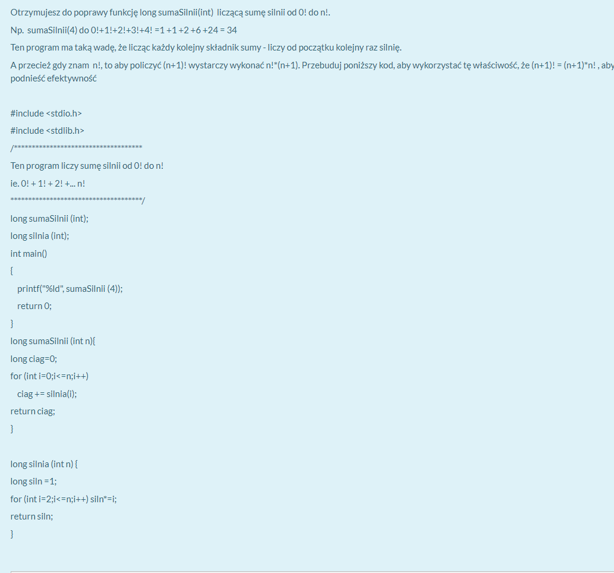
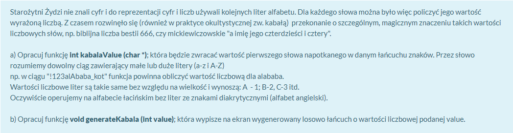
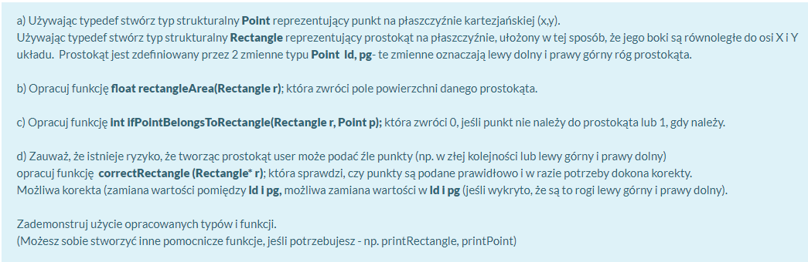
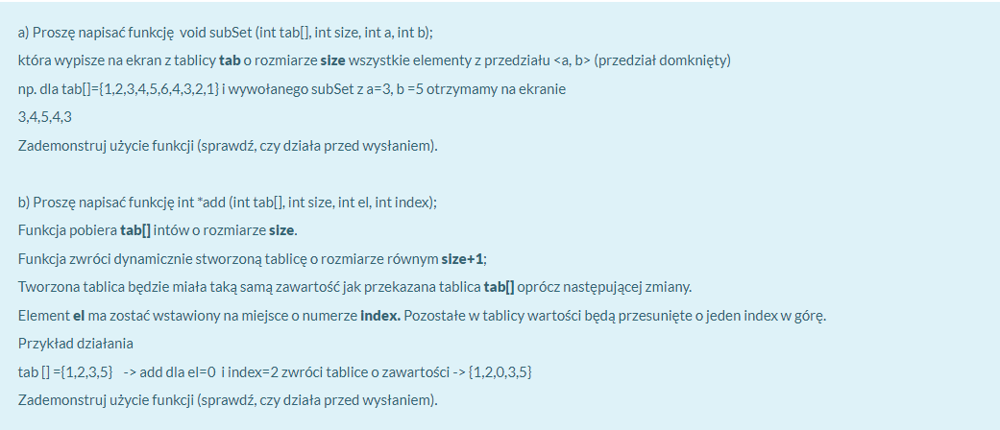

# Kod z zajęć z przedmiotu Podstawy programowania

Zadania zostały wykonane w języku **C**

- projekt 1: program liczący pierwiastek z równania kwadratowego w podanym przedziale
- projekt 2: program sortujący dane z pliku (lista z danymi użytkownika)

Zadania z egzaminu:
- zadanie 1: 

- zadanie 2: 

- zadanie 3: 

- zadanie 4: 
